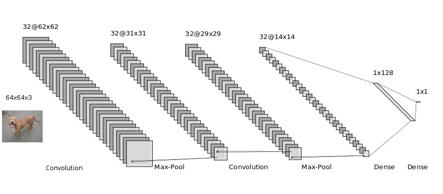

# Dog vs Cat Convolution Neural Network Classifier
         

## Problem statement :

In this Section we are implementing Convolution Neural Network(CNN) Classifier for Classifying dog and cat images. The Total number of images available for training is 25,000 and final testing is done on seperate 10,000 images.
#### Note:This problem statement and dataset is taken from [this](https://www.kaggle.com/c/dogs-vs-cats) Kaggle competition.

## Dependencies
* Google Colaboratory
* Tensorflow 
* Python 
* Matplotlib
* Scikit-Learn

### Test Train Split
Image training set contain 12500 images for each category. I split those into 80% train and 20% means test Split each class images into 10,000 for train and 2,500 for test. 

## Architecture

